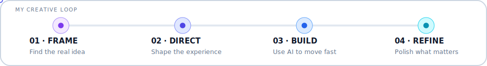

<picture>
  <source media="(prefers-color-scheme: dark)" srcset="./assets/miro-header-dark.svg">
  <source media="(prefers-color-scheme: light)" srcset="./assets/miro-header-light.svg">
  
</picture>

  <strong>Hey, I'm Miro</strong>
  
   
  Creative strategist and AI-native maker from France 🇫🇷

<table>
  <tr>
    <td width="40%" valign="top">
      <h3>✦ Beyond the code</h3>
      I focus on the <strong>idea</strong>, the <strong>experience</strong>, and the <strong>direction</strong> behind a project — then use AI and modern tools to turn ambitious concepts into working prototypes.
        
      <em>My role is to make the right idea clearer, stronger, and real.</em>
    </td>
    <td width="30%" valign="top">
      <h3>🧭 What I bring</h3>
      Product concepts and creative direction 
      Clear, thoughtful UI/UX ideas 
      Fast AI-assisted prototyping 
      A strategic eye for useful ideas
    </td>
    <td width="30%" valign="top">
      <h3>🔭 What I explore</h3>
      AI-first tools and interactions 
      Creative software interfaces 
      Interactive 3D, games and simulations 
      Experiments driven by curiosity
    </td>
  </tr>
</table>

<picture>
  <source media="(prefers-color-scheme: dark)" srcset="./assets/miro-flow-dark.svg">
  <source media="(prefers-color-scheme: light)" srcset="./assets/miro-flow-light.svg">
  
</picture>

<table>
  <tr>
    <td width="68%" valign="middle">
      <strong>Imagine → Direct → Ship</strong> 
      Original concepts and interactions · Clear priorities, UX and identity · Prototype, test and improve with AI.
    </td>
    <td width="32%" align="center" valign="middle">
      
    </td>
  </tr>
</table>

  <strong>✦ Useful before complicated · Original before ordinary · Polished before finished ✦</strong> 
  New ideas rarely begin perfectly. They become interesting through direction.

