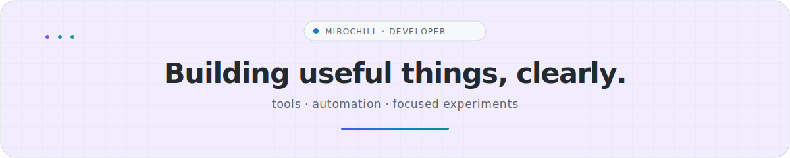

<picture>
  <source media="(prefers-color-scheme: dark)" srcset="./assets/profile-header-dark.svg">
  <source media="(prefers-color-scheme: light)" srcset="./assets/profile-header-light.svg">
  
</picture>

   
  <strong>Developer focused on practical software, clean interfaces, and automation that saves time.</strong>
    

  
  
  

 

## About

I build small apps, scripts, bots, and workflow automations that turn ideas into usable projects. The goal is simple: solve a real problem, keep the experience clear, and improve the details that matter.

<table>
  <tr>
    <td width="50%" valign="top">
      <h3>What I build</h3>
      <ul>
        <li>Lightweight web tools and practical apps</li>
        <li>Scripts that remove repetitive work</li>
        <li>Bots, integrations, and focused utilities</li>
        <li>Fast prototypes refined into real products</li>
      </ul>
    </td>
    <td width="50%" valign="top">
      <h3>How I work</h3>
      <ul>
        <li>Start with the real problem</li>
        <li>Keep interfaces simple and intentional</li>
        <li>Prefer readable, maintainable code</li>
        <li>Ship the core, then polish with purpose</li>
      </ul>
    </td>
  </tr>
</table>

> **Build clearly. Keep it useful. Refine what matters.**

 

  <strong>Explore the work</strong>
   
  Small tools, practical experiments, and projects in progress.
    
  <a href="https://github.com/Mirochill?tab=repositories"><strong>Repositories</strong></a>
  &nbsp;·&nbsp;
  <a href="https://github.com/Mirochill?tab=stars"><strong>Stars</strong></a>

